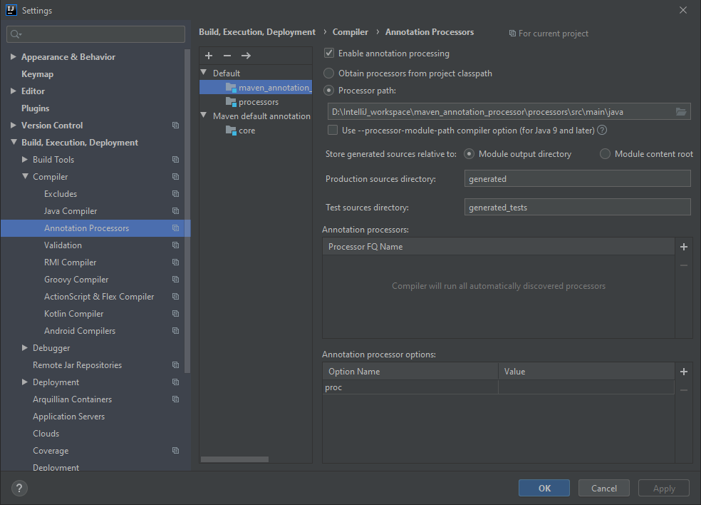
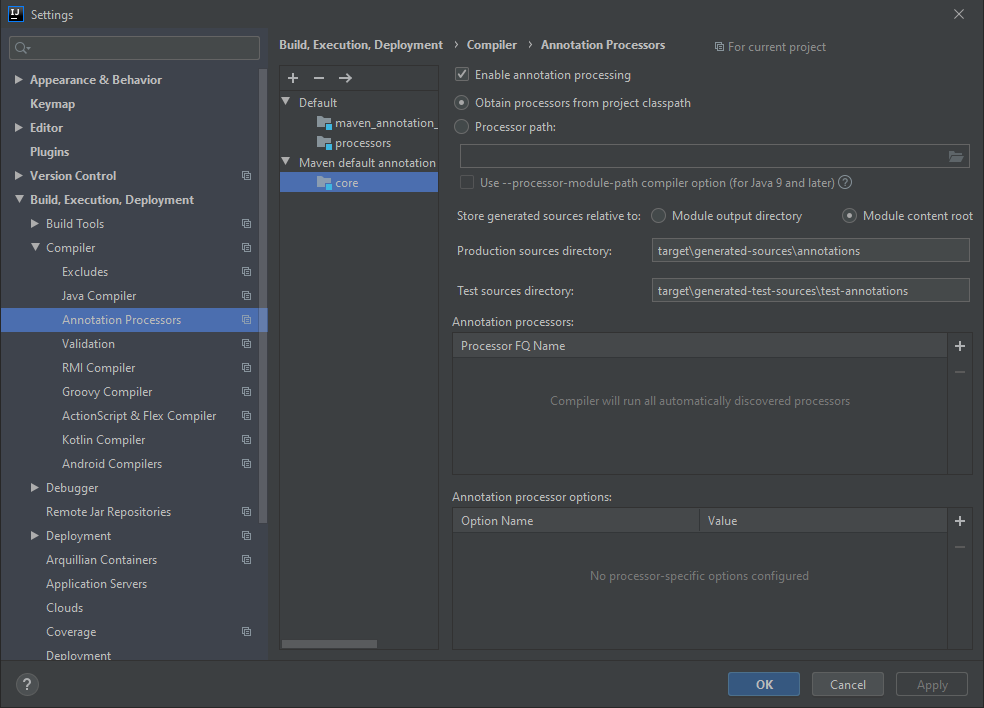

Maven Annotation Processor Template
-----------------------------------
Basic Template for Java Annotation Processing in Intellij with Maven.

## Setup
#### Default Annotation Processor Configuration

#### Maven Default Annotation Processor Configuration

## Run
#### Maven
    mvn clean install

#### Intellij
    Build → Rebuild Project